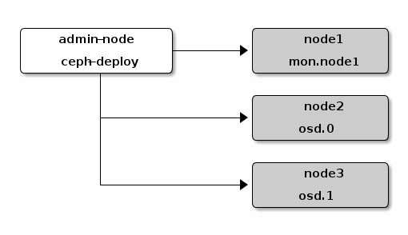

#### Use ceph-deploy to deploy ceph cluster on ubuntu 16.04


#####Environment setup

we need 4 hosts (or virtual machines) to deploy a ceph cluster with 4 nodes (1 `admin` + 1 `monitor` + 2 `storage`) as shown below.




- **install `ceph-deploy` on `admin` node**

	we use ceph `jewel` (v10.2.0) in this example.
	
	```
	$ echo deb https://download.ceph.com/debian-jewel/ $(lsb_release -sc) main | sudo tee /etc/apt/sources.list.d/ceph.list
	
	$ sudo apt-get update && sudo apt-get install ceph-deploy
	```

- **install `ntp` on `each node` to to prevent issues arising from clock drift**

	```
	$ sudo apt-get install ntp
	```

- **enable password-less ssh by copy ssh key file of admin node to each other nodes**

	replacing `{username}` and `{nodename}` with the user name of each node.
	
	***Note:*** `nodename` MUST be the same as `hostname` of each machines.
	
	```
	$ ssh-copy-id -i ~/.ssh/id_rsa.pub {username}@{nodename}
	```

####Deploy ceph cluster on each node

- **create a directory for maintaining the configuration files and keys**

	```
	$ mkdir my-ceph-cluster
	$ cd my-ceph-cluster
	```

- **create cluster**
	
	```
	$ ceph-deploy new {admin-node-hostname}
	```
	
- **install ceph on each node**

	```
	$ ceph-deploy install {admin-node-hostname} {monitor-node-hostname} {storge-node1-hostname} {storge-node2-hostname}
	```

- **initial monitor and gather the keys**

	```
	$ ceph-deploy mon create-initial
	```
	check keys on local directory once you complete the process.
	
	```
	ceph.bootstrap-mds.keyring
	ceph.bootstrap-osd.keyring
	ceph.bootstrap-rgw.keyring
	ceph.client.admin.keyring
    ```

####Config block device on `client` node

- **use ceph-deploy to install ceph on your `client` node from `admin` node**

	```
	$ ssh {admin-node-hostname}
	$ ceph-deploy install {client-node-hostname}
	# copy config file and key file
	$ ceph-deploy admin {client-node-hostname}
	```

    ***Note***: ensure that the keyring file has appropriate read permissions on client node.

	```
	$ sudo chmod +r /etc/ceph/ceph.client.admin.keyring
	```

- **setup a new block device on client node**

  - create a block device image

	```
	$ sudo rbd create {image-name} --size 500G -m {monitor-node-ip} -k /etc/ceph/ceph.client.admin.keyring
	```
  - map the image to a block device
	
	```
	$ sudo rbd map {image-name} --name client.admin -m 192.168.1.25 -k /etc/ceph/ceph.client.admin.keyring
	/dev/rbd0
	```
	
  - check map result

	```
	$ sudo rbd ls
	registry
	```

  - format this block device

	```
	$ sudo mkfs.ext4 -m0 /dev/rbd0
	mke2fs 1.42.13 (17-May-2015)
	Discarding device blocks: done                            
	Creating filesystem with 131072000 4k blocks and 32768000 inodes
	Filesystem UUID: 44c12978-6a00-42fe-bf21-a7334d13cbaa
	Superblock backups stored on blocks: 
	    32768, 98304, 163840, 229376, 294912, 819200, 884736, 1605632, 2654208, 
	    4096000, 7962624, 11239424, 20480000, 23887872, 71663616, 78675968, 
	    102400000
	Allocating group tables: done                            
	Writing inode tables: done                            
	Creating journal (32768 blocks): done
	Writing superblocks and filesystem accounting information: done
	```

  - mount this block device

	```
	$ sudo mkdir /{local-dir}
	$ sudo mount /dev/rbd0 /{local-dir}
	```

  - check mount result

	```
	$ df -hT
	Filesystem     Type      Size  Used Avail Use% Mounted on
	/dev/rbd0      ext4      493G   70M  492G   1% /{local-dir}
	```
Now you can use `/{local-dir}` as block stroge.

####Trouble shooting

**map rbd image error as shown below**

```
$ sudo rbd map {image-name} --name client.admin -m {monitor-node-ip} -k /etc/ceph/ceph.client.admin.keyring
rbd: sysfs write failed
RBD image feature set mismatch. You can disable features unsupported by the kernel with "rbd feature disable".
In some cases useful info is found in syslog - try "dmesg | tail" or so.
rbd: map failed: (6) No such device or address
```

if there is `rbd: sysfs write failed` error occur as above, you should disable some features and retry:

1. check image features

	```
	$ rbd info {image-name}
	## for example
	rbd image 'registry':
	    size 500 GB in 128000 objects
	    order 22 (4096 kB objects)
	    block_name_prefix: rbd_data.109b2ae8944a
	    format: 2
	    features: layering, exclusive-lock, object-map
	    flags: 
	```
	as shown above, there are `layering`, `exclusive-lock`, `object-map` features of this iamge.
	
2. disable add features of this image**

	replacing `{feture-name}` with features shown above

	```	
    $ rbd feature disable {image-name} {feture-name}
    ```

3. retry map image

	```
	$ sudo rbd map {image-name} --name client.admin -m 192.168.1.25 -k /etc/ceph/ceph.client.admin.keyring
	/dev/rbd0
	```